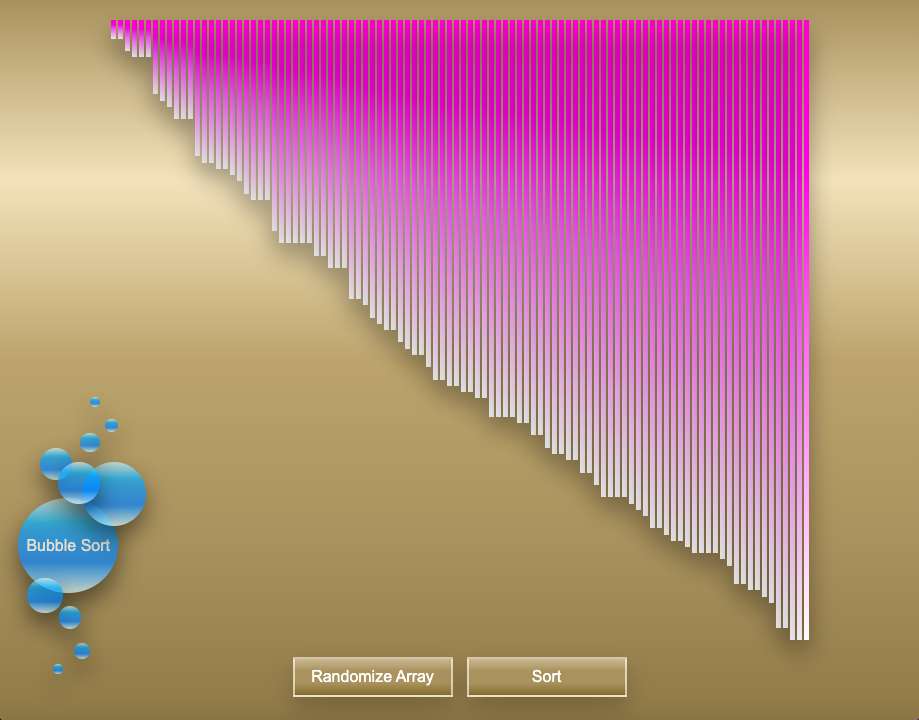

# Visual Sorting Algorithm

[Link to published site](https://annaaxelsson051.github.io/Visual-Sorting-Algorithms/)

## Projektbeskrivning

> Det här är en applikation som ger en visuell överblick över hur sorteringsalgoritmen Bubble sort utför sin operation vid sortering. Till projektet har JavaScript, Html och Css (animeringar) använts.   
 

### Bubbelsortering

> Algoritmen innebär att det område av en lista som skall sorteras gås igenom upprepade gånger och parvisa jämförelser görs av intilliggande element. Om elementen är i fel ordning kastas elementens ordning om.

