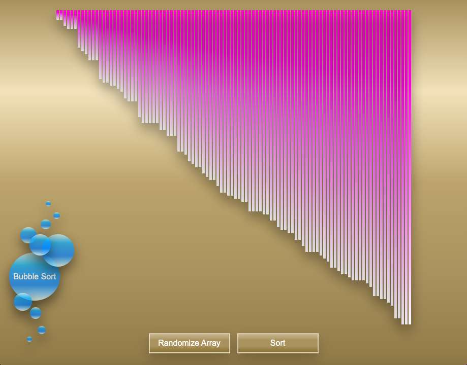

# Sorting Algorithm Visualizer

[Link to published site](https://annaaxelsson051.github.io/Sorting-Algorithm-Visualizer/)

## User Interface

---

## Description

This application provides a visual illustration of how the sorting algorithm Bubble sort performs its operations. Bubble sort is a sorting algorithm that repeatedly steps through the input list element by element, comparing the current element with the one after it, swapping their values if needed. This is repeated until no swaps had to be performed during a pass, meaning that the list has become fully sorted. The algorithm is named for the way the larger elements "bubble" up to the top of the list. 

--- 

## Technologies used

- Vanilla JavaScript
- HTML
- CSS
- Animations

